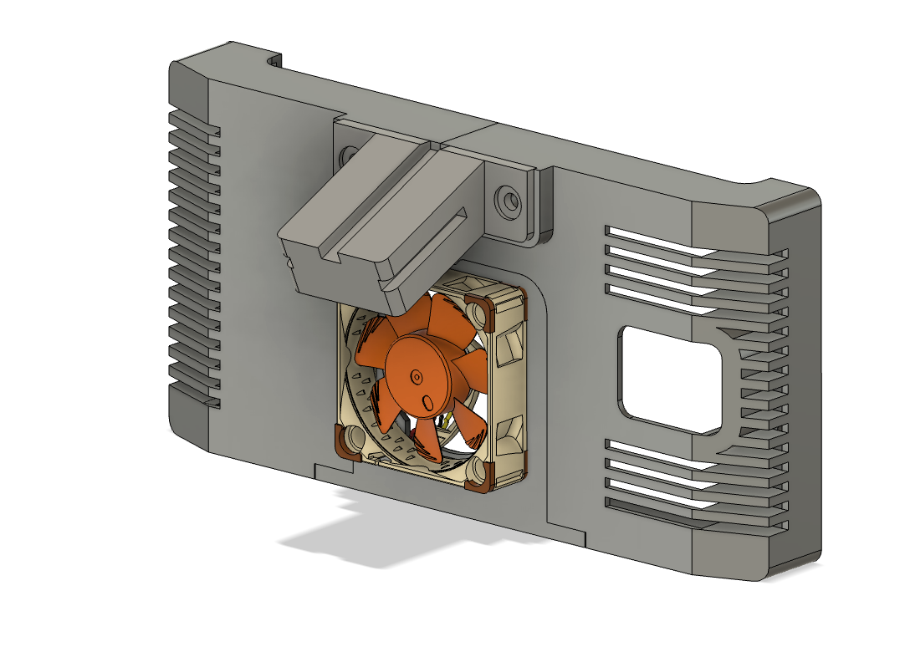
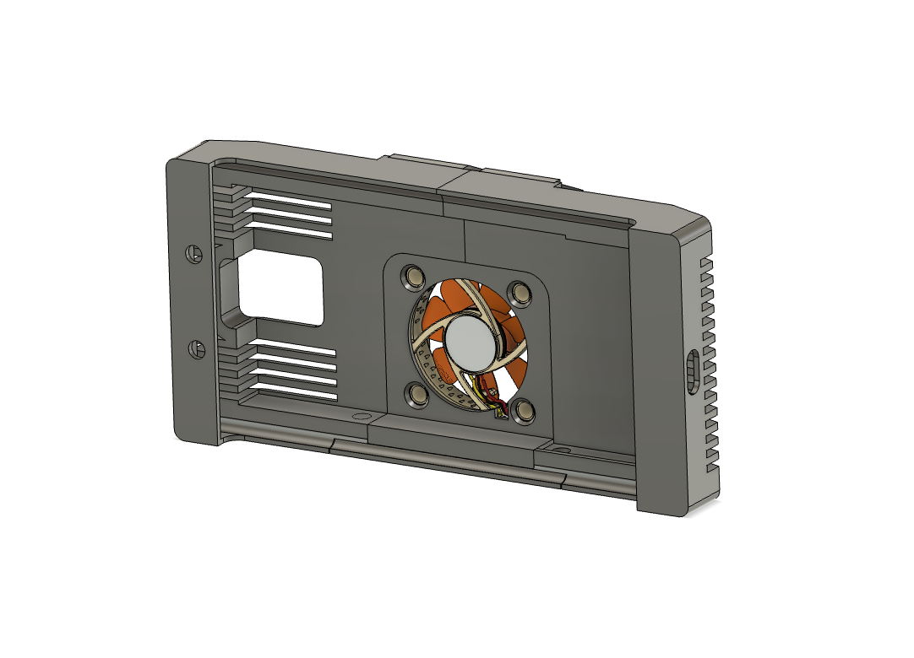
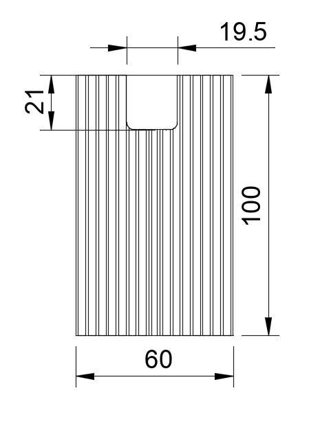

# Case for LeEco LePro3 (Openpilot)
It is designed so that there is space for capacitors in the enclosure.
For more information about the batteryless-mod, have a look at this repository: 
https://github.com/lukasloetkolben/StealthFreon

Parts:
* Heatsink (100x60x10mm)
* Noctua 40mm 5V Fan
* 2x 2,7V 10F Supercap
* Blocking Diode

## 100x60x10mm Heatsink
https://de.aliexpress.com/item/32849272994.html

